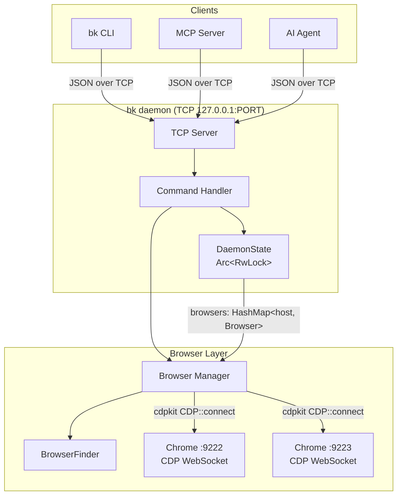
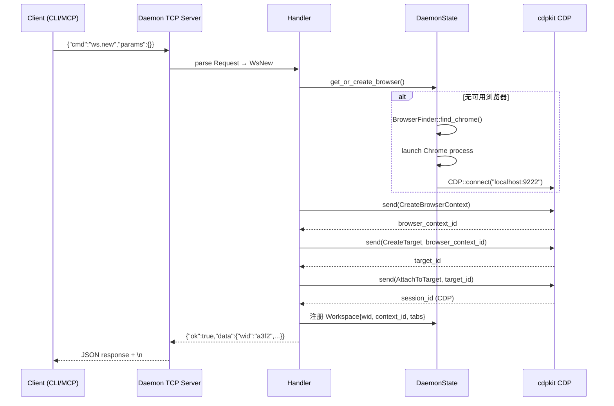
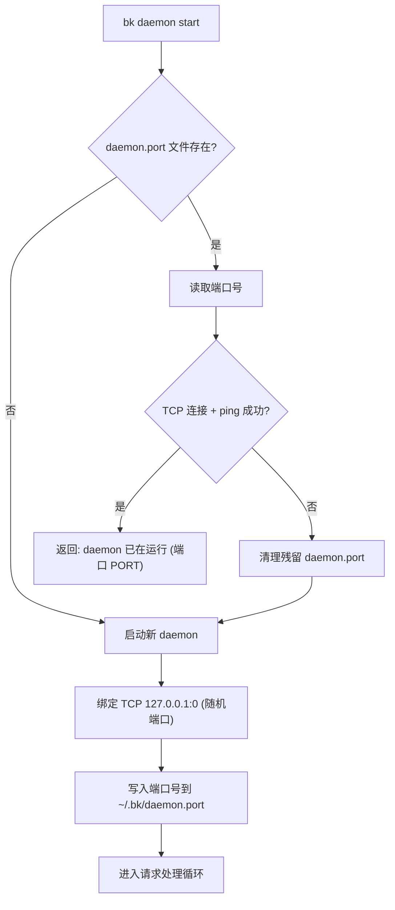
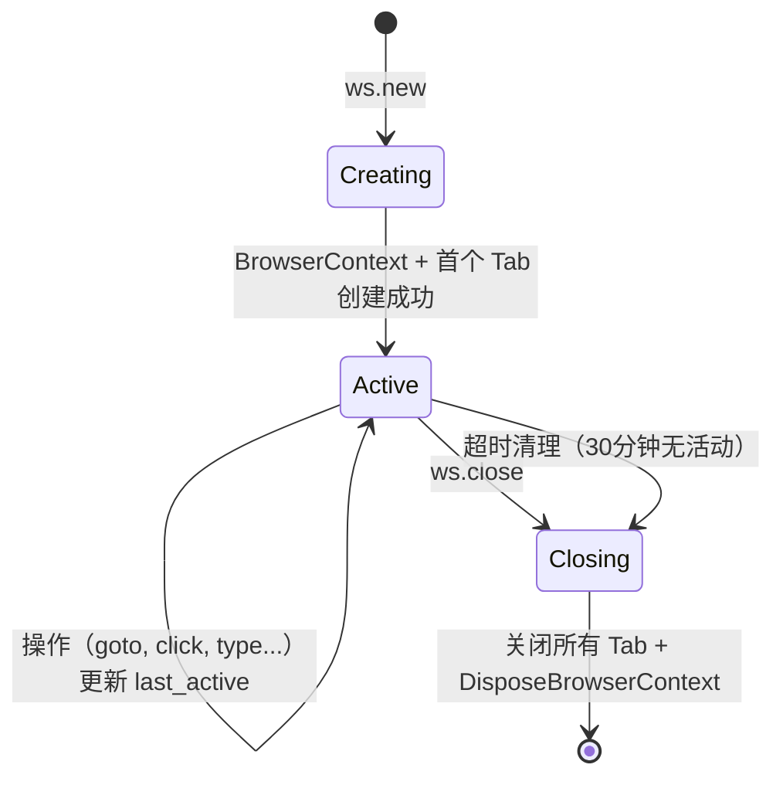

# 设计文档：browserkit 重写

## 概述

browserkit（`bk`）是一个基于 Chrome DevTools Protocol (CDP) 的浏览器控制 CLI 工具。本次重写的核心目标是：

1. **从 Unix Socket 迁移到 TCP 通信**：使用 `127.0.0.1` TCP 端口替代 Unix Socket，实现天然跨平台
2. **Session → Workspace 重命名**：将业务隔离单元从 Session 重命名为 Workspace，避免与 cdpkit-rs 的 CDP `session_id` 概念冲突
3. **Health Check 机制**：引入 `ping` 命令作为 daemon 健康检查端点，区分"端口被占用"和"daemon 正常运行"
4. **多项目并发支持**：通过 `--ws <wid>` 全局选项和显式 workspace_id，支持多个项目同时/交叉调用
5. **Playwright 风格的 Chrome 发现**：使用各平台硬编码已知路径查找 Chrome，按 stable → beta → dev → canary 优先级

### 技术栈

- **语言**：Rust
- **CDP 库**：cdpkit-rs（`cdpkit` crate），提供 `CDP::connect(host)` 连接、`cdp.send(cmd, session_id)` 命令发送、`event_stream` 事件订阅
- **异步运行时**：tokio
- **CLI 解析**：clap（derive 模式）
- **序列化**：serde + serde_json
- **日志**：tracing + tracing-subscriber

### 关键设计决策

| 决策 | 选择 | 理由 |
|------|------|------|
| 进程间通信 | TCP `127.0.0.1` | 跨平台，无需 Unix Socket 适配 |
| 端口发现 | `~/.bk/daemon.port` 文件 | 简单可靠，client 读取文件获取端口 |
| 健康检查 | `ping` 命令 → `{"ok":true,"data":{"status":"running"}}` | 区分端口占用 vs daemon 正常运行 |
| Workspace ID | 4 位随机 hex | 简短易记，支持前缀匹配 |
| Chrome 发现 | 硬编码已知路径（参考 Playwright） | 无需 `which`/`where` 命令，可预测 |
| CDP 连接复用 | 同一 Chrome 实例共享一个 `Arc<CDP>` | 减少 WebSocket 连接数 |
| 并发安全 | `Arc<RwLock<DaemonState>>` | tokio 异步友好，读多写少场景 |

## 架构

### 整体架构



### 概念层次

```
Daemon（后台进程，TCP 127.0.0.1:PORT）
  └── Browser（Chrome 实例，如 localhost:9222）
        └── Workspace（业务隔离单元，基于 CDP BrowserContext）
              └── Tab（标签页，通过 CDP Target/Session 控制）
```

### 数据流



### 模块结构

```
browserkit/src/
  main.rs                 # CLI 入口，clap 命令解析
  lib.rs                  # 库入口，re-export
  error.rs                # BkError 错误类型
  client.rs               # TCP client，发送请求，格式化输出
  browser/
    mod.rs                # Browser 结构体，连接管理
    finder.rs             # BrowserFinder：Chrome 可执行文件发现
    launcher.rs           # Chrome 进程启动
  daemon/
    mod.rs                # daemon 启动/停止/状态检查
    server.rs             # TCP server，连接处理
    handler.rs            # 命令分发与处理
    state.rs              # DaemonState：全局状态管理
    protocol.rs           # Request/Response 协议定义
    persist.rs            # 状态持久化（browsers.json, workspaces.json）
  workspace/
    mod.rs                # Workspace 结构体（原 Session）
    context.rs            # CDP BrowserContext 封装
  page/
    mod.rs                # Page/Tab 结构体
    navigation.rs         # 导航操作（goto, reload, back, forward）
    capture.rs            # 截图、PDF、HTML 捕获
    state.rs              # 页面状态获取（可交互元素列表）
    interaction.rs        # 点击、输入、滚动等交互
  mcp/
    mod.rs                # MCP Server 入口
    tools.rs              # MCP tool 定义与映射
```


## 组件与接口

### 1. 通信协议（Protocol）

#### 请求格式

```rust
#[derive(Debug, Clone, Serialize, Deserialize)]
pub struct Request {
    pub cmd: String,
    #[serde(default)]
    pub params: serde_json::Value,
}
```

传输格式：换行分隔的 JSON（`\n` delimited）

```json
{"cmd":"ping","params":{}}
{"cmd":"ws.new","params":{"label":"project-a"}}
{"cmd":"goto","params":{"wid":"a3f2","url":"https://example.com"}}
```

#### 响应格式

```rust
#[derive(Debug, Clone, Serialize, Deserialize)]
pub struct Response {
    pub ok: bool,
    #[serde(skip_serializing_if = "Option::is_none")]
    pub data: Option<serde_json::Value>,
    #[serde(skip_serializing_if = "Option::is_none")]
    pub error: Option<String>,
}
```

成功：`{"ok":true,"data":{...}}`
错误：`{"ok":false,"error":"workspace not found: a3f2"}`

#### 流式响应

对于 `network.monitor` 和 `cdp.events` 等持续输出命令，daemon 持续写入多行 JSON 直到 client 断开连接：

```json
{"ok":true,"data":{"type":"request","url":"..."}}
{"ok":true,"data":{"type":"response","status":200,...}}
...
```

#### 命令列表

| 命令 | 参数 | 说明 |
|------|------|------|
| `ping` | — | 健康检查 |
| `daemon.status` | — | daemon 状态 |
| `daemon.stop` | — | 停止 daemon |
| `browser.connect` | `host` | 连接已有浏览器 |
| `browser.list` | — | 列出浏览器 |
| `browser.disconnect` | `host` | 断开浏览器 |
| `ws.new` | `host?`, `label?` | 创建 workspace |
| `ws.list` | — | 列出 workspace |
| `ws.close` | `wid` | 关闭 workspace |
| `ws.info` | `wid` | workspace 详情 |
| `tab.new` | `wid`, `url?` | 新建 tab |
| `tab.list` | `wid` | 列出 tab |
| `tab.switch` | `wid`, `tid` | 切换 active tab |
| `tab.close` | `wid`, `tid` | 关闭 tab |
| `goto` | `wid`, `url`, `tab?` | 导航 |
| `reload` | `wid`, `tab?` | 刷新 |
| `nav.back` | `wid`, `tab?` | 后退 |
| `nav.forward` | `wid`, `tab?` | 前进 |
| `nav.url` | `wid`, `tab?` | 获取 URL |
| `nav.title` | `wid`, `tab?` | 获取标题 |
| `nav.wait` | `wid`, `tab?` | 等待加载 |
| `screenshot` | `wid`, `tab?`, `full_page?`, `selector?` | 截图 |
| `pdf` | `wid`, `tab?` | 生成 PDF |
| `html` | `wid`, `tab?`, `selector?` | 获取 HTML |
| `page.state` | `wid`, `tab?`, `screenshot?` | 页面状态 |
| `page.search` | `wid`, `text`, `tab?` | 搜索文本 |
| `click` | `wid`, `index?`, `x?`, `y?`, `tab?` | 点击 |
| `type` | `wid`, `index`, `text`, `tab?` | 输入 |
| `scroll` | `wid`, `direction`, `tab?` | 滚动 |
| `act.select` | `wid`, `index`, `value`, `tab?` | 下拉选择 |
| `act.hover` | `wid`, `index`, `tab?` | 悬停 |
| `act.focus` | `wid`, `index`, `tab?` | 聚焦 |
| `eval` | `wid`, `expr`, `tab?` | 执行 JS |
| `js.await` | `wid`, `expr`, `tab?` | 异步 JS |
| `js.file` | `wid`, `path`, `tab?` | 执行 JS 文件 |
| `storage.cookies.get` | `wid`, `tab?` | 获取 cookie |
| `storage.cookies.set` | `wid`, `cookies`, `tab?` | 设置 cookie |
| `storage.cookies.clear` | `wid`, `tab?` | 清除 cookie |
| `storage.local.get` | `wid`, `key`, `tab?` | 获取 localStorage |
| `storage.local.set` | `wid`, `key`, `value`, `tab?` | 设置 localStorage |
| `storage.export` | `wid`, `tab?` | 导出 storage |
| `storage.import` | `wid`, `state`, `tab?` | 导入 storage |
| `network.monitor` | `wid`, `tab?` | 网络监控（流式） |
| `network.har` | `wid`, `url`, `tab?` | HAR 录制 |
| `network.block` | `wid`, `pattern`, `tab?` | 屏蔽请求 |
| `network.unblock` | `wid`, `pattern`, `tab?` | 取消屏蔽 |
| `cdp.send` | `wid`, `method`, `params?`, `tab?` | 原始 CDP |
| `cdp.events` | `wid`, `filter?`, `tab?` | CDP 事件（流式） |

### 2. BrowserFinder

参考 Playwright 的 `registry/index.ts`，按优先级查找 Chrome 可执行文件：

```rust
pub struct BrowserFinder;

impl BrowserFinder {
    /// 按优先级查找 Chrome：stable → beta → dev → canary
    pub fn find() -> Result<PathBuf, BkError> {
        let channels = Self::known_paths();
        for (channel, path) in &channels {
            if Path::new(path).exists() {
                tracing::info!(channel = channel, path = path, "Found Chrome");
                return Ok(PathBuf::from(path));
            }
        }
        Err(BkError::BrowserNotFound(
            channels.iter().map(|(_, p)| p.to_string()).collect()
        ))
    }

    fn known_paths() -> Vec<(&'static str, String)> {
        // 参考 Playwright registry/index.ts 第 706-736 行
        if cfg!(target_os = "macos") {
            vec![
                ("chrome", "/Applications/Google Chrome.app/Contents/MacOS/Google Chrome".into()),
                ("chrome-beta", "/Applications/Google Chrome Beta.app/Contents/MacOS/Google Chrome Beta".into()),
                ("chrome-dev", "/Applications/Google Chrome Dev.app/Contents/MacOS/Google Chrome Dev".into()),
                ("chrome-canary", "/Applications/Google Chrome Canary.app/Contents/MacOS/Google Chrome Canary".into()),
            ]
        } else if cfg!(target_os = "linux") {
            vec![
                ("chrome", "/opt/google/chrome/chrome".into()),
                ("chrome-beta", "/opt/google/chrome-beta/chrome".into()),
                ("chrome-dev", "/opt/google/chrome-unstable/chrome".into()),
                ("chrome-canary", "/opt/google/chrome-canary/chrome".into()),
            ]
        } else {
            // Windows: 检查 LOCALAPPDATA, PROGRAMFILES, PROGRAMFILES(X86)
            let prefixes = [
                std::env::var("LOCALAPPDATA").unwrap_or_default(),
                std::env::var("PROGRAMFILES").unwrap_or_default(),
                std::env::var("PROGRAMFILES(X86)").unwrap_or_default(),
            ];
            let mut paths = Vec::new();
            for prefix in &prefixes {
                if !prefix.is_empty() {
                    paths.push(("chrome", format!("{}\\Google\\Chrome\\Application\\chrome.exe", prefix)));
                    paths.push(("chrome-beta", format!("{}\\Google\\Chrome Beta\\Application\\chrome.exe", prefix)));
                    paths.push(("chrome-dev", format!("{}\\Google\\Chrome Dev\\Application\\chrome.exe", prefix)));
                    paths.push(("chrome-canary", format!("{}\\Google\\Chrome SxS\\Application\\chrome.exe", prefix)));
                }
            }
            paths
        }
    }
}
```

### 3. Daemon 生命周期

#### 启动流程



#### 自动启动

当 CLI 无法连接 daemon 时，自动启动：

```rust
// client.rs
async fn connect_or_start() -> Result<TcpStream> {
    match try_connect().await {
        Ok(stream) => Ok(stream),
        Err(_) => {
            // 以后台进程启动 daemon
            start_daemon_background()?;
            // 等待 daemon 就绪（轮询 ping）
            wait_for_daemon_ready(Duration::from_secs(5)).await?;
            try_connect().await
        }
    }
}
```

### 4. Workspace 管理

#### Workspace 生命周期



#### wid 前缀匹配

```rust
fn resolve_wid(state: &DaemonState, prefix: &str) -> Result<String> {
    let matches: Vec<&String> = state.workspaces.keys()
        .filter(|wid| wid.starts_with(prefix))
        .collect();
    match matches.len() {
        0 => Err(BkError::WorkspaceNotFound(prefix.to_string())),
        1 => Ok(matches[0].clone()),
        _ => Err(BkError::AmbiguousWid(prefix.to_string(), matches.into_iter().cloned().collect())),
    }
}
```

### 5. Tab 与 CDP Session 映射

每个 Tab 对应一个 CDP Target，通过 `AttachToTarget` 获取 CDP `session_id`，后续所有 CDP 命令通过该 `session_id` 路由：

```rust
// 创建 Tab（参考 Playwright crBrowser.ts → doCreateNewPage）
// Playwright 始终以 about:blank 创建 target，后续再导航
let target = cdp.send(CreateTarget::new("about:blank").with_browser_context_id(context_id), None).await?;

// Playwright 使用 Target.setAutoAttach 自动 attach，但 browserkit 可以显式 attach
let attach = cdp.send(AttachToTarget::new(&target.target_id).with_flatten(true), None).await?;
// attach.session_id 是 CDP 协议层的 session_id，用于路由命令
let tab = Tab {
    tid: generate_hex_id(),
    target_id: target.target_id,
    cdp_session_id: attach.session_id,  // CDP session_id
    // ...
};

// Session 初始化（参考 Playwright FrameSession._initialize）
// 必须启用核心 CDP 域才能正常工作
cdp.send(page::Enable::new(), Some(&tab.cdp_session_id)).await?;
cdp.send(page::SetLifecycleEventsEnabled::new(true), Some(&tab.cdp_session_id)).await?;
cdp.send(runtime::Enable::new(), Some(&tab.cdp_session_id)).await?;
cdp.send(network::Enable::new(), Some(&tab.cdp_session_id)).await?;

// 发送命令到特定 Tab
cdp.send(Navigate::new(url), Some(&tab.cdp_session_id)).await?;
```

**关键实现说明**（来自 Playwright 源码分析）：
- **Cookie 操作通过 browser session 发送**：Playwright 使用 `Storage.getCookies`/`Storage.setCookies`（非 `Network` 域），且通过 browser session（`session_id = None`）发送，以 `browserContextId` 隔离
- **导航历史**：`back`/`forward` 通过 `Page.getNavigationHistory` 获取历史列表，再用 `Page.navigateToHistoryEntry` 导航到指定 `entryId`
- **全页面截图**：使用 `Page.captureScreenshot` 的 `captureBeyondViewport: true` 参数，无需修改视口大小
- **点击前准备**：Playwright 在点击前执行 `DOM.scrollIntoViewIfNeeded` → `DOM.getContentQuads` 计算坐标 → hit target 检查

### 6. MCP Server

MCP Server 作为独立进程，通过 TCP 与 daemon 通信，将 MCP tool 调用转换为 daemon 请求：

```rust
// MCP tool 调用示例
// browser_navigate(workspace_id="a3f2", url="https://example.com")
// → 转换为 daemon 请求：
// {"cmd":"goto","params":{"wid":"a3f2","url":"https://example.com"}}
```

所有 workspace 级别的 MCP tool 必须显式传入 `workspace_id`，不依赖 `~/.bk/current`。


## 数据模型

### 核心数据结构

```rust
/// Daemon 全局状态
pub struct DaemonState {
    /// host → Browser
    pub browsers: HashMap<String, Browser>,
    /// wid → Workspace
    pub workspaces: HashMap<String, Workspace>,
}

/// 浏览器实例
pub struct Browser {
    pub host: String,                    // "localhost:9222"
    pub cdp: Arc<CDP>,                   // cdpkit CDP 连接（共享）
    pub managed: bool,                   // daemon 自动启动 = true
    pub pid: Option<u32>,                // managed 浏览器的进程 PID
}

/// 业务隔离单元（基于 CDP BrowserContext）
pub struct Workspace {
    pub wid: String,                     // 4 位随机 hex，如 "a3f2"
    pub browser_host: String,            // 所属浏览器 host
    pub browser_context_id: String,      // CDP BrowserContext ID
    pub label: Option<String>,           // 业务标签
    pub tabs: HashMap<String, Tab>,      // tid → Tab
    pub active_tab: Option<String>,      // 当前活跃 tab 的 tid
    pub created_at: u64,                 // Unix timestamp
    pub last_active: u64,                // 最后活跃时间
}

/// 标签页
pub struct Tab {
    pub tid: String,                     // 4 位随机 hex，如 "b7e1"
    pub target_id: String,               // CDP Target ID
    pub cdp_session_id: String,          // CDP Session ID（用于路由命令）
    pub url: String,                     // 当前 URL
    pub title: String,                   // 当前标题
}

/// 页面可交互元素
#[derive(Debug, Clone, Serialize, Deserialize)]
pub struct ElementInfo {
    pub index: usize,
    pub tag: String,                     // "button", "input", "a", ...
    pub text: String,                    // 可见文本
    pub x: f64,
    pub y: f64,
    pub width: f64,
    pub height: f64,
    #[serde(skip_serializing_if = "Option::is_none")]
    pub href: Option<String>,
    #[serde(skip_serializing_if = "Option::is_none")]
    pub placeholder: Option<String>,
}
```

### 持久化数据

```rust
/// ~/.bk/browsers.json
#[derive(Serialize, Deserialize)]
pub struct PersistedBrowser {
    pub host: String,
    pub managed: bool,
    pub pid: Option<u32>,
}

/// ~/.bk/workspaces.json
#[derive(Serialize, Deserialize)]
pub struct PersistedWorkspace {
    pub wid: String,
    pub browser_host: String,
    pub browser_context_id: String,
    pub label: Option<String>,
    pub tabs: Vec<PersistedTab>,
    pub active_tab: Option<String>,
    pub created_at: u64,
    pub last_active: u64,
}

#[derive(Serialize, Deserialize)]
pub struct PersistedTab {
    pub tid: String,
    pub target_id: String,
    pub url: String,
    pub title: String,
}
```

### 运行时文件

```
~/.bk/
  daemon.port            # daemon TCP 端口号（纯文本）
  current                # 当前默认 wid（CLI 便捷功能）
  browsers.json          # 浏览器状态持久化
  workspaces.json        # workspace 元数据持久化
  chrome-{port}/         # managed Chrome 的 user-data-dir
```

### CLI 命令结构（clap）

```rust
#[derive(Parser)]
#[command(name = "bk", about = "Browser automation CLI")]
pub struct Cli {
    /// 目标 workspace ID
    #[arg(short = 'w', long = "ws", global = true)]
    pub workspace: Option<String>,

    /// 输出格式
    #[arg(long, default_value = "text", global = true)]
    pub format: OutputFormat,

    #[command(subcommand)]
    pub command: Command,
}

#[derive(Subcommand)]
pub enum Command {
    // Daemon 管理
    Daemon {
        #[command(subcommand)]
        action: DaemonAction,
    },
    // Browser 管理
    Browser {
        #[command(subcommand)]
        action: BrowserAction,
    },
    // Workspace 管理
    Ws {
        #[command(subcommand)]
        action: WsAction,
    },
    // Tab 管理
    Tab {
        #[command(subcommand)]
        action: TabAction,
    },
    // 导航
    Nav {
        #[command(subcommand)]
        action: NavAction,
    },
    // 页面操作
    Page {
        #[command(subcommand)]
        action: PageAction,
    },
    // 交互操作
    Act {
        #[command(subcommand)]
        action: ActAction,
    },
    // JS 执行
    Js {
        #[command(subcommand)]
        action: JsAction,
    },
    // Storage
    Storage {
        #[command(subcommand)]
        action: StorageAction,
    },
    // Network
    Network {
        #[command(subcommand)]
        action: NetworkAction,
    },
    // CDP
    Cdp {
        #[command(subcommand)]
        action: CdpAction,
    },

    // === 快捷别名 ===
    /// bk new = ws new
    New {
        #[arg(long)]
        host: Option<String>,
        #[arg(long)]
        label: Option<String>,
    },
    /// bk ls = ws list
    Ls,
    /// bk rm = ws close
    Rm { wid: String },
    /// bk goto = nav goto
    Goto { url: String },
    /// bk shot = screenshot
    Shot {
        #[arg(short, long)]
        output: Option<String>,
        #[arg(long)]
        full_page: bool,
        #[arg(long)]
        selector: Option<String>,
    },
    /// bk click
    Click {
        #[arg(long)]
        index: Option<usize>,
        #[arg(long)]
        x: Option<f64>,
        #[arg(long)]
        y: Option<f64>,
    },
    /// bk type
    Type {
        #[arg(long)]
        index: usize,
        text: String,
    },
    /// bk eval
    Eval { expr: String },
    /// bk scroll
    Scroll { direction: Option<String> },
    // ... 一次性命令
    /// bk open <url>
    Open { url: String },
}
```

### CDP 命令映射（参考 Playwright Chromium 实现）

> 以下映射参考了 Playwright 源码中 `packages/playwright-core/src/server/chromium/` 目录下的实际 CDP 调用模式。

#### 1. BrowserContext 与 Target 管理

| browserkit 操作 | CDP 方法 | Playwright 参考 |
|-----------------|----------|----------------|
| 创建 BrowserContext | `Target.createBrowserContext` (params: `disposeOnDetach: true`) | `crBrowser.ts` → `doCreateNewContext()` 通过 browser session 发送，支持 proxy 配置 |
| 删除 BrowserContext | `Target.disposeBrowserContext` | `crBrowser.ts` → `doClose()` 先关闭 beforeunload 对话框，再 dispose |
| 创建 Tab | `Target.createTarget` (params: `url: "about:blank"`, `browserContextId`) | `crBrowser.ts` → `doCreateNewPage()` 始终以 `about:blank` 创建，后续再导航 |
| 关闭 Tab | `Target.closeTarget` 或 `Page.close`（支持 beforeunload） | `crPage.ts` → `closePage()` 根据 `runBeforeUnload` 选择不同方式 |
| Attach Tab | `Target.attachToTarget` (params: `flatten: true`) | `crPage.ts` → `_initialize()` 中设置 `Target.setAutoAttach` 自动 attach |
| 自动 Attach | `Target.setAutoAttach` (params: `autoAttach: true`, `waitForDebuggerOnStart: true`, `flatten: true`) | Playwright 在 session 初始化时启用，用于自动 attach OOPIF 子 frame |

#### 2. Session 初始化（Tab 创建后的 CDP 域启用）

Playwright 在 `FrameSession._initialize()` 中并行启用以下 CDP 域（参考 `crPage.ts`）：

```
Page.enable                              # 启用 Page 域事件
Page.getFrameTree                        # 获取 frame 树结构
Page.setLifecycleEventsEnabled(true)     # 启用生命周期事件（load, DOMContentLoaded）
Page.createIsolatedWorld                 # 创建隔离 JS 执行环境
Runtime.enable                           # 启用 Runtime 域（执行上下文创建/销毁事件）
Log.enable                               # 启用日志事件
Network.enable                           # 启用网络事件（在 crNetworkManager 中）
Target.setAutoAttach                     # 自动 attach 子 target
Runtime.runIfWaitingForDebugger          # 恢复被调试器暂停的执行
```

可选启用（根据配置）：
```
Emulation.setDeviceMetricsOverride       # 视口大小设置
Emulation.setFocusEmulationEnabled       # 焦点模拟（headless 模式）
Emulation.setTouchEmulationEnabled       # 触摸模拟
Emulation.setScriptExecutionDisabled     # 禁用 JS
Emulation.setLocaleOverride              # 语言环境
Emulation.setTimezoneOverride            # 时区
Security.setIgnoreCertificateErrors      # 忽略 HTTPS 错误
Page.setBypassCSP                        # 绕过 CSP
Page.addScriptToEvaluateOnNewDocument    # 注入初始化脚本
```

**browserkit 简化方案**：仅启用核心域 `Page.enable` + `Page.setLifecycleEventsEnabled` + `Runtime.enable` + `Network.enable`，按需启用 `Emulation` 域。

#### 3. 导航操作

| browserkit 操作 | CDP 方法 | Playwright 实现细节 |
|-----------------|----------|-------------------|
| goto | `Page.navigate` (params: `url`, `referrer`, `frameId`) | `FrameSession._navigate()` 检查 `response.errorText` 和 `response.isDownload`，返回 `loaderId` 用于跟踪导航 |
| reload | `Page.reload` | `crPage.ts` → 直接调用，无额外参数 |
| back | `Page.getNavigationHistory` → `Page.navigateToHistoryEntry` | `crPage.ts` → `_go(-1)` 先获取历史记录，计算 `currentIndex + delta`，再导航到对应 `entryId` |
| forward | `Page.getNavigationHistory` → `Page.navigateToHistoryEntry` | `crPage.ts` → `_go(+1)` 同上 |
| 等待加载 | 监听 `Page.lifecycleEvent` 事件 | Playwright 监听 `load` 和 `DOMContentLoaded` 事件名，通过 `FrameManager.frameLifecycleEvent()` 分发 |

**导航等待机制**（参考 `frames.ts` → `FrameManager`）：
- Playwright 通过 `Page.lifecycleEvent` 事件监听 `load` / `DOMContentLoaded`
- 通过 `Network.requestWillBeSent` / `Network.loadingFinished` / `Network.loadingFailed` 跟踪 inflight 请求数
- 当 inflight 请求数归零时启动 networkidle 定时器
- browserkit 的 `nav.wait` 应实现类似的 lifecycle 事件等待

#### 4. 截图与 PDF

| browserkit 操作 | CDP 方法 | Playwright 实现细节 |
|-----------------|----------|-------------------|
| 截图（视口） | `Page.captureScreenshot` (params: `format`, `quality`, `clip`) | `crPage.ts` → `takeScreenshot()` 先调用 `Page.getLayoutMetrics` 获取 `visualViewport`，计算 `clip` 区域 |
| 截图（全页面） | `Page.getLayoutMetrics` → `Page.captureScreenshot` (params: `captureBeyondViewport: true`) | `screenshotter.ts` → 通过 JS 计算 `fullPageSize`（`Math.max(body.scrollWidth, documentElement.scrollWidth, ...)`），设置 `captureBeyondViewport: true` 捕获超出视口的内容 |
| 截图（元素） | `DOM.scrollIntoViewIfNeeded` → `DOM.getContentQuads` → `Page.captureScreenshot` | 先滚动元素到可见区域，获取元素坐标，再用 `clip` 参数截取 |
| PDF | `Page.printToPDF` | 直接调用 |

**截图关键参数**（参考 `crPage.ts` → `takeScreenshot()`）：
```rust
// clip 计算逻辑（参考 Playwright）
let clip = ScreenshotClip {
    x: visual_viewport.page_x + rect.x,
    y: visual_viewport.page_y + rect.y,
    width: rect.width / visual_viewport.scale,
    height: rect.height / visual_viewport.scale,
    scale: if is_viewport_shot { visual_viewport.scale } else { 1.0 },
};
// 全页面截图使用 captureBeyondViewport: true
```

#### 5. 视口与设备模拟

| browserkit 操作 | CDP 方法 | Playwright 实现细节 |
|-----------------|----------|-------------------|
| 设置视口 | `Emulation.setDeviceMetricsOverride` | `FrameSession._updateViewport()` 设置 `width`, `height`, `deviceScaleFactor`, `mobile`, `screenOrientation` 等 |
| 调整窗口 | `Browser.getWindowForTarget` → `Browser.setWindowBounds` | Playwright 在 headful 模式下同时调整窗口大小（加上 insets 偏移量），确保视口尺寸准确 |

#### 6. 交互操作（鼠标/键盘）

| browserkit 操作 | CDP 方法 | Playwright 实现细节 |
|-----------------|----------|-------------------|
| 点击 | `Input.dispatchMouseEvent` × 3（mouseMoved → mousePressed → mouseReleased） | `crInput.ts` → `RawMouseImpl` 分三步：`move(forClick=true)` → `down(clickCount)` → `up(clickCount)`。Playwright 在点击前会：1) 等待元素 visible + enabled + stable，2) `DOM.scrollIntoViewIfNeeded` 滚动到可见区域，3) `DOM.getContentQuads` 计算点击坐标，4) 检查 hit target 确保没有遮挡 |
| 悬停 | `Input.dispatchMouseEvent` (type: `mouseMoved`) | 仅发送 `mouseMoved` 事件 |
| 输入文本 | `Input.insertText` | `crInput.ts` → `RawKeyboardImpl.sendText()` 直接使用 `Input.insertText` 批量插入文本。Playwright 的 `keyboard.type()` 对 US 键盘布局中的字符使用 `keyDown/keyUp`，其他字符使用 `insertText` |
| 按键 | `Input.dispatchKeyEvent` (type: `keyDown`/`rawKeyDown` → `keyUp`) | `crInput.ts` → 有文本的键用 `keyDown`，无文本的键用 `rawKeyDown`。Mac 上还会附带 `commands` 参数（编辑命令） |
| 滚动 | `Input.dispatchMouseEvent` (type: `mouseWheel`, `deltaX`, `deltaY`) | `crInput.ts` → `RawMouseImpl.wheel()` |

**点击流程详解**（参考 `dom.ts` → `ElementHandle._performPointerAction()`）：
```
1. 等待元素状态：visible + enabled + stable（通过注入 JS 检查）
2. 滚动到可见区域：DOM.scrollIntoViewIfNeeded（失败时尝试不同 scrollIntoView 对齐方式）
3. 计算点击坐标：DOM.getContentQuads → 取第一个 quad 的中心点
4. Hit target 检查：通过注入 JS 验证点击坐标处的元素是否为目标元素
5. 执行点击：mouseMoved → mousePressed → mouseReleased
6. 等待可能触发的导航完成
```

**browserkit 简化方案**：
- `click --index` 模式：通过 `Runtime.evaluate` 获取元素坐标 → `DOM.scrollIntoViewIfNeeded` → `Input.dispatchMouseEvent` 三连
- `click --x --y` 模式：直接发送 `Input.dispatchMouseEvent` 三连
- `type` 命令：先 `Runtime.evaluate` 聚焦元素，再 `Input.insertText` 批量输入

#### 7. DOM 查询与元素操作

| browserkit 操作 | CDP 方法 | Playwright 实现细节 |
|-----------------|----------|-------------------|
| 获取元素坐标 | `DOM.getBoxModel` 或 `DOM.getContentQuads` | `FrameSession._getBoundingBox()` 使用 `DOM.getBoxModel` 获取 border quad 计算 rect；`_getContentQuads()` 获取精确四边形 |
| 滚动元素到可见 | `DOM.scrollIntoViewIfNeeded` | `FrameSession._scrollRectIntoViewIfNeeded()` 直接调用，处理 `Node does not have a layout object` 和 `Node is detached` 错误 |
| 获取 HTML | `Runtime.evaluate` (执行 `document.documentElement.outerHTML`) | Playwright 通过注入 JS 获取 |
| 获取页面标题 | `Runtime.evaluate` (执行 `document.title`) | 同上 |
| 获取当前 URL | 从 frame 状态缓存读取（通过 `Page.frameNavigated` 事件更新） | Playwright 不每次查询 CDP，而是通过事件维护 frame URL 状态 |
| 页面可交互元素 | `Runtime.evaluate` (注入 JS 遍历 DOM) | browserkit 通过注入 JS 脚本查询所有可交互元素（button, input, a, select 等），获取坐标和属性 |

#### 8. Cookie 与 Storage

| browserkit 操作 | CDP 方法 | Playwright 实现细节 |
|-----------------|----------|-------------------|
| 获取 Cookie | `Storage.getCookies` (params: `browserContextId`) | `crBrowser.ts` → `doGetCookies()` 通过 **browser session**（非 page session）发送，按 browserContextId 过滤 |
| 设置 Cookie | `Storage.setCookies` (params: `cookies`, `browserContextId`) | `crBrowser.ts` → `addCookies()` 同样通过 browser session 发送 |
| 清除 Cookie | `Storage.clearCookies` (params: `browserContextId`) | `crBrowser.ts` → `doClearCookies()` |
| localStorage | `Runtime.evaluate` (注入 JS 操作 `window.localStorage`) | Playwright 通过 JS 注入操作 |

**重要发现**：Playwright 的 Cookie 操作使用 `Storage` 域（非 `Network` 域），且通过 **browser session**（`None` session_id）而非 page session 发送，以 `browserContextId` 作为隔离边界。browserkit 应采用相同模式。

#### 9. 网络监控

| browserkit 操作 | CDP 方法 | Playwright 实现细节 |
|-----------------|----------|-------------------|
| 启用网络 | `Network.enable` | `crNetworkManager.ts` → `addSession()` 在 session 初始化时启用 |
| 网络监控 | 监听 `Network.requestWillBeSent` / `Network.responseReceived` / `Network.loadingFinished` / `Network.loadingFailed` | `crNetworkManager.ts` 还监听 `Network.requestWillBeSentExtraInfo`、`Network.responseReceivedExtraInfo`、`Network.requestServedFromCache` 以及 WebSocket 相关事件 |
| 请求拦截 | `Fetch.enable` + 监听 `Fetch.requestPaused` | `crNetworkManager.ts` → `_updateProtocolRequestInterception()` 通过 `Fetch` 域实现 |
| 屏蔽 URL | `Network.setBlockedURLs` | 直接调用 |
| 离线模式 | `Network.emulateNetworkConditions` (params: `offline: true`) | `crNetworkManager.ts` → `_setOfflineForSession()` |

#### 10. 其他

| browserkit 操作 | CDP 方法 | 说明 |
|-----------------|----------|------|
| 执行 JS | `Runtime.evaluate` | 同步执行 |
| 异步 JS | `Runtime.evaluate` (params: `awaitPromise: true`) | 等待 Promise 完成 |
| 获取窗口信息 | `Browser.getWindowForTarget` / `Browser.getWindowBounds` | Playwright 用于 headful 模式下的窗口管理 |


## 正确性属性（Correctness Properties）

*属性（Property）是指在系统所有有效执行中都应成立的特征或行为——本质上是对系统应做什么的形式化陈述。属性是人类可读规范与机器可验证正确性保证之间的桥梁。*

### Property 1: 协议请求序列化往返一致性

*For any* 有效的 Request 对象，将其序列化为 JSON 字符串再反序列化，SHALL 产生与原始对象等价的 Request 对象。

**Validates: Requirements 2.7**

### Property 2: 协议响应序列化往返一致性

*For any* 有效的 Response 对象（包括成功响应和错误响应），将其序列化为 JSON 字符串再反序列化，SHALL 产生与原始对象等价的 Response 对象。

**Validates: Requirements 2.8**

### Property 3: 协议消息结构正确性

*For any* 有效的 Request 对象，其 JSON 序列化结果 SHALL 包含 `"cmd"` 字段（字符串类型）和 `"params"` 字段（对象类型）。*For any* 成功 Response，其 JSON 序列化结果 SHALL 包含 `"ok":true` 和 `"data"` 字段。*For any* 错误 Response，其 JSON 序列化结果 SHALL 包含 `"ok":false` 和 `"error"` 字段（字符串类型）。

**Validates: Requirements 2.2, 2.3, 2.4**

### Property 4: 无效 JSON 输入产生错误响应

*For any* 非法 JSON 字符串（包括空字符串、截断的 JSON、非 JSON 文本），协议处理器 SHALL 返回 `ok:false` 的错误响应，且 error 字段包含解析错误描述。

**Validates: Requirements 2.5**

### Property 5: BrowserFinder 优先级正确性

*For any* 一组存在的 Chrome 可执行文件路径，BrowserFinder SHALL 返回优先级最高的路径（stable > beta > dev > canary）。

**Validates: Requirements 3.8**

### Property 6: 连接复用不变量

*For any* 数量的 Workspace 连接到同一 Chrome 实例（同一 host），DaemonState 中 SHALL 只存在一个对应的 Browser 条目（即一个 CDP WebSocket 连接）。

**Validates: Requirements 3.7**

### Property 7: Managed 浏览器自动清理

*For any* managed 浏览器，当其所有关联的 Workspace 都被关闭后，该浏览器 SHALL 从 DaemonState 中移除。

**Validates: Requirements 3.6**

### Property 8: ID 生成格式正确性

*For any* 新创建的 Workspace ID（wid）或 Tab ID（tid），其格式 SHALL 为恰好 4 个十六进制字符（匹配正则 `^[0-9a-f]{4}$`）。

**Validates: Requirements 4.1, 5.1**

### Property 9: Workspace 列表完整性

*For any* 一组已创建且未关闭的 Workspace，执行 `ws.list` 命令 SHALL 返回包含所有这些 Workspace 的列表，且不包含已关闭的 Workspace。

**Validates: Requirements 4.4**

### Property 10: Workspace 关闭后不可访问

*For any* 已关闭的 Workspace（wid），后续对该 wid 的任何操作 SHALL 返回 "workspace not found" 错误。

**Validates: Requirements 4.5, 16.3**

### Property 11: last_active 时间戳单调递增

*For any* Workspace，每次对其执行操作后，其 `last_active` 时间戳 SHALL 大于或等于操作前的值。

**Validates: Requirements 4.8**

### Property 12: wid 前缀匹配正确性

*For any* 一组 Workspace ID 和一个唯一前缀（即该前缀只匹配一个 wid），前缀解析 SHALL 返回该唯一匹配的完整 wid。若前缀匹配多个 wid，SHALL 返回歧义错误。若前缀不匹配任何 wid，SHALL 返回未找到错误。

**Validates: Requirements 4.10**

### Property 13: Tab 列表完整性

*For any* Workspace 中已创建且未关闭的 Tab，执行 `tab.list` 命令 SHALL 返回包含所有这些 Tab 的列表。

**Validates: Requirements 5.2**

### Property 14: Tab 切换正确性

*For any* Workspace 和其中存在的 Tab（tid），执行 `tab.switch` 后，该 Workspace 的 `active_tab` SHALL 等于指定的 tid。

**Validates: Requirements 5.3**

### Property 15: 关闭 active_tab 后自动切换

*For any* 拥有多个 Tab 的 Workspace，当关闭 active_tab 时，Workspace 的 active_tab SHALL 自动切换到剩余 Tab 中的第一个。

**Validates: Requirements 5.4**

### Property 16: 默认 Tab 解析

*For any* 未指定 `--tab` 参数的命令，daemon SHALL 使用该 Workspace 的 active_tab 执行操作。

**Validates: Requirements 5.5**

### Property 17: 页面状态元素过滤

*For any* `page.state` 返回的元素列表，所有元素的 width SHALL 大于 0 且 height SHALL 大于 0。

**Validates: Requirements 8.3**

### Property 18: Storage 导出/导入往返一致性

*For any* 有效的 storage 状态（cookie + localStorage），执行 export 后再 import SHALL 恢复等价的 storage 状态。

**Validates: Requirements 11.8**

### Property 19: 状态持久化往返一致性

*For any* 有效的 DaemonState 元数据（browsers + workspaces），持久化到 JSON 文件后再读取恢复 SHALL 产生等价的元数据。

**Validates: Requirements 15.3**

### Property 20: CLI 别名等价性

*For any* CLI 快捷别名命令（如 `bk new`、`bk ls`、`bk goto`），其生成的 daemon Request SHALL 与对应的完整命令（如 `bk ws new`、`bk ws list`、`bk nav goto`）生成的 Request 等价。

**Validates: Requirements 14.3**

### Property 21: 错误响应退出码

*For any* daemon 返回 `ok:false` 的错误响应，CLI SHALL 以非零退出码退出。

**Validates: Requirements 14.5**

### Property 22: MCP tool 到 daemon 请求映射正确性

*For any* MCP tool 调用，MCP Server SHALL 生成正确的 daemon Request，且返回的结果为有效 JSON。

**Validates: Requirements 17.3, 17.4**

### Property 23: MCP workspace 级别 tool 必须携带 workspace_id

*For any* workspace 级别的 MCP tool 调用（navigate、click、type、scroll 等），若未提供 workspace_id 参数，SHALL 返回错误。

**Validates: Requirements 17.5**


## 错误处理

### 错误类型层次

```rust
#[derive(Debug, thiserror::Error)]
pub enum BkError {
    // 浏览器相关
    #[error("Chrome not found. Checked paths: {0:?}")]
    BrowserNotFound(Vec<String>),

    #[error("Browser connection failed: {0}")]
    BrowserConnectionFailed(String),

    #[error("Browser startup timeout (5s)")]
    BrowserStartupTimeout,

    // Workspace 相关
    #[error("workspace not found: {0}")]
    WorkspaceNotFound(String),

    #[error("ambiguous workspace prefix '{0}', matches: {1:?}")]
    AmbiguousWid(String, Vec<String>),

    // Tab 相关
    #[error("tab not found: {0}")]
    TabNotFound(String),

    #[error("no active tab in workspace {0}")]
    NoActiveTab(String),

    #[error("element index {0} out of range (max: {1})")]
    ElementIndexOutOfRange(usize, usize),

    // Daemon 相关
    #[error("daemon not running (port file not found)")]
    DaemonNotRunning,

    #[error("daemon health check failed")]
    DaemonHealthCheckFailed,

    // 协议相关
    #[error("invalid request: {0}")]
    InvalidRequest(String),

    // CDP 相关
    #[error("CDP error: {0}")]
    Cdp(#[from] cdpkit::CdpError),

    // IO 相关
    #[error("IO error: {0}")]
    Io(#[from] std::io::Error),

    #[error("JSON error: {0}")]
    Json(#[from] serde_json::Error),

    // 持久化相关
    #[error("persistence file corrupted: {0}")]
    PersistenceCorrupted(String),

    #[error("{0}")]
    Other(String),
}
```

### 错误处理策略

| 场景 | 处理方式 |
|------|---------|
| Chrome 未找到 | 返回 `BrowserNotFound`，列出所有已检查路径 |
| Chrome 启动超时 | 返回 `BrowserStartupTimeout`，清理已启动的进程 |
| CDP 连接断开 | 返回错误，清理关联的 Browser 和 Workspace 状态 |
| Workspace 不存在 | 返回 `WorkspaceNotFound(wid)` |
| wid 前缀歧义 | 返回 `AmbiguousWid`，列出所有匹配的 wid |
| 元素 index 越界 | 返回 `ElementIndexOutOfRange(index, max)` |
| Daemon 未运行 | CLI 自动启动 daemon 并重试一次 |
| 持久化文件损坏 | 记录警告日志，以空状态启动 |
| 无效 JSON 请求 | 返回 `InvalidRequest`，包含解析错误描述 |
| JS 执行异常 | 返回 CDP 错误信息 |

### 错误响应格式

所有错误通过统一的 Response 格式返回：

```json
{"ok":false,"error":"workspace not found: a3f2"}
{"ok":false,"error":"element index 15 out of range (max: 12)"}
{"ok":false,"error":"Chrome not found. Checked paths: [\"/opt/google/chrome/chrome\", ...]"}
```

CLI 收到错误响应时，打印 error 字段内容到 stderr，并以退出码 1 退出。

## 测试策略

### 双重测试方法

本项目采用单元测试 + 属性测试的双重测试策略：

- **单元测试**：验证具体示例、边界情况和错误条件
- **属性测试**：验证跨所有输入的通用属性

两者互补，共同提供全面的测试覆盖。

### 属性测试（Property-Based Testing）

**库选择**：`proptest`（Rust 生态中最成熟的属性测试库）

**配置要求**：
- 每个属性测试最少运行 100 次迭代
- 每个属性测试必须通过注释引用设计文档中的属性编号
- 标签格式：`Feature: browserkit-rewrite, Property {number}: {property_text}`

**属性测试覆盖**：

| 属性 | 测试内容 | 生成器 |
|------|---------|--------|
| Property 1 | Request 序列化往返 | 随机生成 Request 枚举变体 |
| Property 2 | Response 序列化往返 | 随机生成 Response（成功/错误） |
| Property 3 | 协议消息结构 | 随机生成 Request/Response，检查 JSON 结构 |
| Property 4 | 无效 JSON 处理 | 随机生成非法字符串 |
| Property 5 | BrowserFinder 优先级 | 随机生成存在/不存在的路径组合 |
| Property 8 | ID 格式 | 多次调用 ID 生成函数 |
| Property 12 | wid 前缀匹配 | 随机生成 wid 集合和前缀 |
| Property 17 | 元素过滤 | 随机生成包含零尺寸元素的列表 |
| Property 19 | 状态持久化往返 | 随机生成 DaemonState 元数据 |
| Property 20 | CLI 别名等价性 | 遍历所有别名，比较生成的 Request |

**每个正确性属性必须由单个属性测试实现。**

### 单元测试覆盖

| 测试类别 | 测试内容 |
|---------|---------|
| Daemon 启动 | 端口文件写入、重复启动检测、残留清理 |
| Health Check | ping 响应格式、daemon status 信息 |
| Browser 管理 | connect/disconnect/list、managed vs unmanaged |
| Workspace CRUD | new/list/close/info、label 设置 |
| Tab 管理 | new/list/switch/close、active_tab 自动切换 |
| 导航 | goto/reload/back/forward/url/title |
| 截图 | viewport/full-page/selector/output |
| 页面状态 | 元素检测、元素类型识别 |
| 交互 | click by index/coords、type、scroll |
| JS 执行 | eval/await/file、异常处理 |
| Storage | cookies get/set/clear、localStorage、export/import |
| 网络 | monitor 流式输出、block/unblock |
| CLI | 参数解析、--ws 全局选项、--format 输出 |
| 错误处理 | 各种错误场景的响应格式和退出码 |
| 持久化 | 文件损坏恢复、空状态启动 |

### 集成测试

需要实际 Chrome 浏览器的测试作为集成测试运行：

- 完整的 workspace 生命周期（创建 → 导航 → 操作 → 关闭）
- 多 workspace 并发操作
- 浏览器自动启动和清理
- MCP tool 端到端调用
- 一次性快捷命令（`bk open`、`bk shot <url>`）

### 测试依赖

```toml
[dev-dependencies]
proptest = "1"
tokio-test = "0.4"
tempfile = "3"
```

